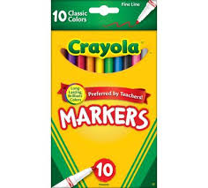
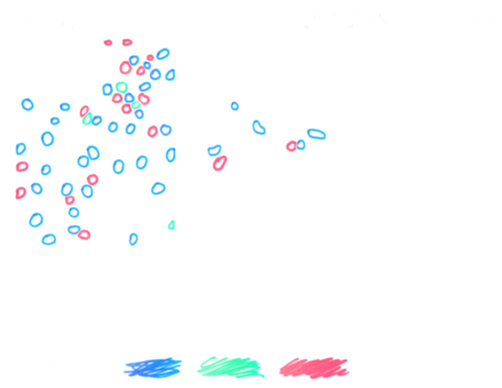
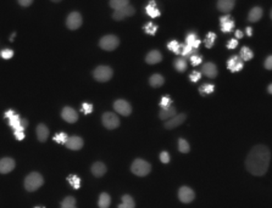

Paperworks - Image Annotation with Paper and Markers
====================================================

Contour annotation with mouse is tedious and stressful, and
annotation precision is usually limited by the size of monitor.
The aim of this project is to revolutionize contour annotation
with a great ancient invention: paper.  The paperwork image
annotation process is high-precision, high-throughput and
enjoyable.

# [Demo: Prostate MRI Images](doc/prostate.md)

# Workflow

## 1. Import images and generate PDF tasks.
	

Checkout source code
```
git clone https://github.com/aaalgo/paperworks
cd paperworks
```
Put images into `paperworks/images` and run
```
# optionally modify defaults.py
./rebuild.sh
```
PDF documents will be generated under `paperworks/jobs`.
The software tries to pack multiple images into single pages
whenever possible.  Each PDF file has at most 20 pages.

## 2. Annotate with markers.


Crayola markers work better than crayons!

There are several sample boxes to collect colors used.
Each color used must appear in one sample box (see below); it doesn't
matter which boxes you use.

Use red and blue, red, blue and green.  Multiple colors are necessary to
separate touching objects.

(Circles are for image registration.)

## 3. Scan.


Images must be scaned in portrait mode.  It's OK to feed images with
mixed rotations and in random orders.  Each page is tracked by its
barcode.

Recommended configuration is 24-bit color with resolution = 200.
Put scanned images into `paperworks/scan/*.tiff`.

## 4. Registration.
Scanned images are registered and transformed to match PDF documents.
The grayscale channel is then removed by transforming image into
HSV colorspace and applying some thresholding.




```
./manage.py scan --run
```
Some visualizations will be produced in `paperworks/aligned`.

## 5. Masks.


For each input image a `*.png` file will be produced in the same
location as the image.  The pixel values of the
mask file are 1, 2, ..., each corresponding to a different color used,
sorted by the H value of the color (R -> G -> B).

## 6. Fix Failed Pages

The process might fail for certain pages.  It's OK to ignore them.
After all steps are done, run

```
./manage.py gen_tasks --run
```

To produce PDF files for the missing/failed pages.  Then go to step 2.


# Prerequisites
```
apt-get install zbar-tools
pip install reportlab scikit-learn scikit-image django imageio opencv-python
```

# Tips

- Use red and blue, or red, blue and green.

- Images have to be properly scaled before importing.

# Technical Details

## 2D Bin Packing
```
flow/pack.py
```

## Color Processing
```
flow/color.py
```
## Layout and Registration

Image registration and normalization is done by detecting the
circle centers, and fitting an affine transformatoin with the locations.

```
layout/__init__.py
flow/paper.py
flow/register.py
```

# Dependencies

- `apt-get install zbar-tools`
- `pip3 install scikit-image imageio django`

# My Other Projects

- [PicPac](https://github.com/aaalgo/picpac-demos) A image database for
deep-learning.
- [Owl](https://github.com/aaalgo/owl) My image annotation framework
  that goes with PicPac.  Only good for bounding boxes though.
